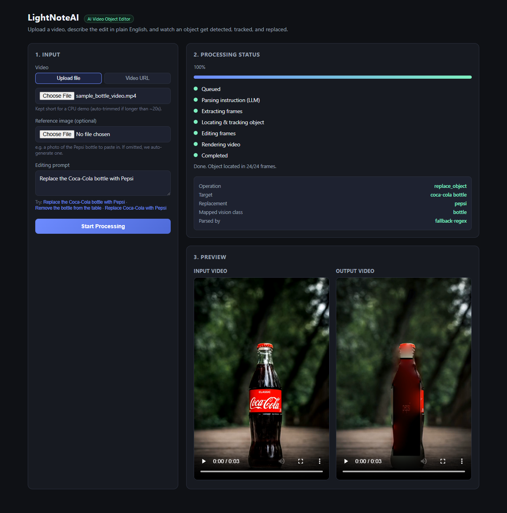

# LightNoteAI — AI Video Object Editor

Upload a video, describe an edit in plain English ("Replace the Coca-Cola
bottle with Pepsi"), and get back a video with the object detected,
tracked across frames, and replaced/removed/relabeled.

Built for the LightNoteAI Full-Stack AI Developer technical assignment.



## Demo

- Local run instructions: see [Setup](#setup) below.
- Demo video: `docs/demo.mp4` (add your recording here before submitting).
- Sample input clip for testing: `samples/sample_bottle_video.mp4`.

## Architecture

```
┌─────────────┐      multipart/form-data       ┌────────────────────┐
│   React UI  │ ───────────────────────────────▶│   FastAPI backend  │
│  (Vite)     │◀─────────── JSON status ─────────│                    │
└─────────────┘        poll GET /api/jobs/:id    └─────────┬──────────┘
                                                             │ enqueue
                                                   ┌─────────▼──────────┐
                                                   │  asyncio job queue  │
                                                   │  (2 workers)        │
                                                   └─────────┬──────────┘
                                                             │
                     ┌───────────────────────────────────────┼───────────────────────────────┐
                     ▼                                       ▼                                ▼
          1. Instruction Parser                    2. Vision Pipeline                4. Render
          (LLM → structured JSON,          (YOLOv8-seg detect+segment per     (ffmpeg: frames →
           regex fallback offline)          frame, greedy centroid tracking,   H.264 + re-mux
                                             OpenCV edit: inpaint / seamless    original audio)
                                             clone / text overlay)
```

**Processing pipeline for one job**, mirroring the job-status states the UI
polls:

1. **`parsing_instruction`** — the natural-language prompt is sent to an LLM
   with a strict JSON schema (`operation`, `target_object`,
   `replacement_object`, `target_text`, `replacement_text`). If no LLM key
   is configured, a deterministic regex/keyword parser produces the same
   schema so the whole app still works with zero API keys.
2. The extracted `target_object` phrase (e.g. "Coca-Cola bottle") is mapped
   to the nearest class the vision model actually knows (`bottle`) via a
   synonym table — a real, practical constraint of using an off-the-shelf
   80-class detector instead of an open-vocabulary one.
3. **`detecting_object`** — ffmpeg extracts frames (downscaled for CPU
   speed).
4. **`tracking_object`** / **`editing_frames`** — for every frame,
   **YOLOv8n-seg** (Ultralytics, COCO-pretrained) returns bounding boxes +
   pixel masks in one pass. A lightweight greedy tracker picks the instance
   whose class matches and whose mask centroid is closest to the previous
   frame's (with a short hold-over if a frame is missed), giving temporally
   coherent detections without a heavier video-object-tracking model. Each
   frame is then edited with OpenCV:
   - **replace** → the reference image (or an auto-generated placeholder /
     text-to-image result) is resized to the object's bounding box and
     composited with `cv2.seamlessClone` (Poisson blending) so lighting/
     color blends into the scene.
   - **remove** → `cv2.inpaint` (Telea) fills the masked region.
   - **replace text** → the region is inpainted, then the new text is drawn
     back in with `cv2.putText`.
5. **`rendering_video`** — edited frames are re-encoded with ffmpeg and the
   original audio track is re-muxed in.
6. **`completed`** — output video + a note on how many frames the object
   was actually found in (useful signal when detection is uncertain).

### Why this approach

- **YOLOv8n-seg over SAM/GroundingDINO**: gives box + mask in a single fast
  CPU-friendly forward pass, is a two-line install via `ultralytics`, and
  directly covers the assignment's own example (Coca-Cola *bottle* → COCO
  class `bottle`). SAM would give better masks but needs a text-conditioned
  detector in front of it (e.g. GroundingDINO) to know *which* object to
  segment — more moving parts and much heavier CPU cost for a take-home
  demo. The tracker/detector is isolated behind `ObjectTracker.locate()` in
  `backend/app/services/vision.py`, so swapping in SAM2's video predictor or
  GroundingDINO later is a localized change, not a rewrite.
- **LLM instruction parsing with an offline fallback**: the assignment asks
  the system to understand operation/target/replacement, not just to
  regex-match a fixed sentence shape. The LLM path (Anthropic/OpenAI/Gemini,
  whichever key is configured) handles arbitrary phrasing; the fallback
  parser exists so the grader can run the whole thing with zero API keys.
- **Classic CV edits (inpaint / seamless clone) over a diffusion inpainting
  model**: production quality was explicitly de-emphasized in favor of a
  sound, explainable, and CPU-runnable pipeline. `editor.py` is a small set
  of pure functions so a diffusion-based inpainter (e.g. Stable Diffusion
  inpainting via `diffusers`) could replace `replace_object`/`remove_object`
  without touching detection, tracking, job orchestration, or the API.
- **In-process asyncio job queue instead of Celery/Redis**: satisfies the
  "background processing / job queue" bonus with zero extra infrastructure
  to run locally. `job_store.py` isolates queueing behind a small interface
  (`create_job`, `get`, `set_processor`) so it can be swapped for a real
  broker without touching the API or pipeline code.

## AI / models used

| Purpose | Model / API | Notes |
|---|---|---|
| Instruction understanding | Claude / OpenAI / Gemini (configurable) | strict-JSON prompt; regex fallback if no key set |
| Object detection + segmentation | YOLOv8n-seg (Ultralytics, COCO-pretrained) | auto-downloads weights (~7MB) on first run |
| Optional replacement image | OpenAI Images API (`gpt-image-1`), else a synthesized placeholder graphic | only used when no reference image is uploaded |
| Cross-frame tracking | Custom greedy centroid/class matcher | see `ObjectTracker` in `vision.py` |
| Compositing / inpainting | OpenCV (`seamlessClone`, `inpaint`) | no extra model weights needed |

## Requirements coverage

- ✅ Video upload, optional reference image upload, prompt input, start
  processing, live status, output preview — all in the React UI.
- ✅ NL instruction parsed into `{operation, target, replacement}` via an
  LLM (with graceful offline fallback).
- ✅ Object detection → segmentation → cross-frame tracking → remove/replace
  → render, implemented with a real pretrained model (YOLOv8n-seg).
- ✅ Backend owns all processing logic; the frontend only uploads and polls.
- **Bonus implemented**: object removal, text replacement (simplified —
  inpaint + redraw), video-URL input, reference-image-based replacement,
  background job queue, structured status API, input validation & error
  surfacing to the UI.

## Setup

### Prerequisites
- Python 3.11+, Node.js 18+, **ffmpeg + ffprobe on PATH** (video I/O is
  delegated entirely to ffmpeg).

### Backend

```bash
cd backend
python -m venv venv
venv\Scripts\activate        # Windows; use `source venv/bin/activate` on macOS/Linux
pip install -r requirements.txt
copy .env.example .env       # `cp` on macOS/Linux — all keys optional, see below
uvicorn app.main:app --reload --port 8000
```

The first request that runs a video job downloads `yolov8n-seg.pt`
(~7MB) automatically into `backend/`.

### Frontend

```bash
cd frontend
npm install
npm run dev
```

Open `http://localhost:5173`. The Vite dev server proxies `/api` and
`/media` to `http://localhost:8000` (see `vite.config.js`).

### Headless smoke test (optional)

`frontend/e2e_demo.mjs` drives the real UI end-to-end with Playwright
(upload the sample video, submit the example prompt, poll to completion)
and saves screenshots to `docs/screenshots/` — useful for verifying the
full stack without a browser open, or for regenerating the README
screenshot. Requires both dev servers running:

```bash
cd frontend
npm install -D playwright && npx playwright install chromium
node e2e_demo.mjs
```

### Configuring an LLM (optional but recommended)

Edit `backend/.env`:

```
LLM_PROVIDER=anthropic        # or "openai", "gemini", "none"
ANTHROPIC_API_KEY=sk-ant-...
```

With no key set, `LLM_PROVIDER` falls back to a regex/keyword parser
automatically — the app still runs end-to-end.

### Docker (alternative)

```bash
docker compose up --build
```

Note: the frontend's production build talks to the API via
`VITE_API_BASE_URL` (build-time env var) rather than the dev proxy — set it
to your backend's URL when deploying frontend and backend on different
origins.

## API

- `POST /api/jobs` — `multipart/form-data`: `prompt` (required), `video`
  file **or** `video_url`, optional `reference_image`. Returns the created
  job.
- `GET /api/jobs/{job_id}` — job status, progress %, parsed instruction,
  input/output/reference media URLs.
- `GET /api/jobs/{job_id}/download` — download the output file directly.

## Known limitations

- **Detector vocabulary is fixed to 80 COCO classes.** "Coca-Cola bottle"
  is mapped to the closest class (`bottle`) via a synonym table, not
  recognized as a specific brand — an open-vocabulary detector
  (GroundingDINO, OWL-ViT) would remove this constraint at the cost of
  much heavier inference.
- **Tracking is a simple greedy nearest-centroid match with a short
  hold-over**, not a dedicated video object tracker (SAM2/DeepSORT) — fast
  camera motion, occlusion, or multiple same-class objects in frame can
  cause it to lock onto the wrong instance.
- **Replacement compositing is 2D** (resize + seamless clone into the
  bounding box) — it does not model 3D pose/perspective of the original
  object, so results look best on roughly frontal, single-object shots.
  This is the area a production system would most likely swap for a
  diffusion-based inpainting/compositing model.
- **Text replacement** is simplified: it inpaints the target region and
  draws the replacement text with a fixed font rather than running
  OCR + font/style matching.
- Videos longer than `MAX_VIDEO_SECONDS` (default 20s) are auto-trimmed —
  a deliberate limit to keep the CPU-only reference pipeline fast for a
  take-home demo; raise it (or add a GPU) for longer clips.
- Job state is in-memory (single-process) — restarting the backend loses
  in-flight/completed job records (output files on disk are unaffected).
- No auth/rate-limiting — out of scope for this assignment but required
  before any real deployment.
